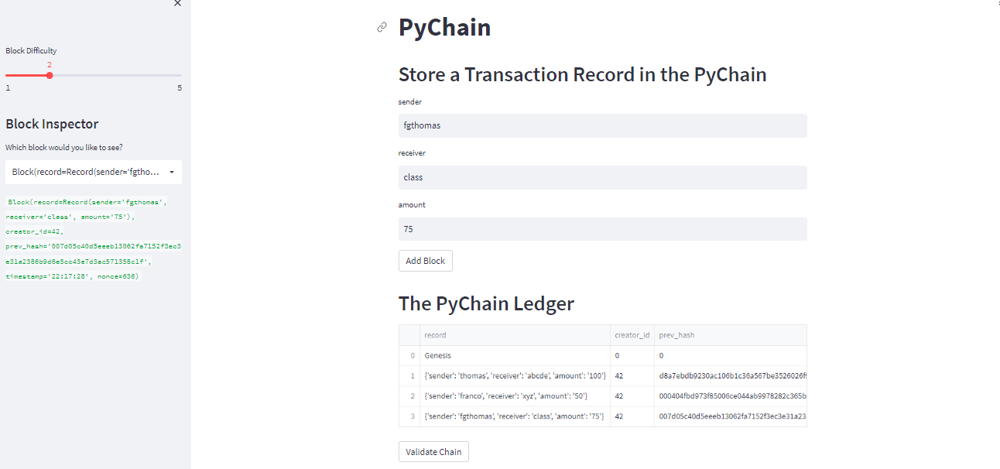
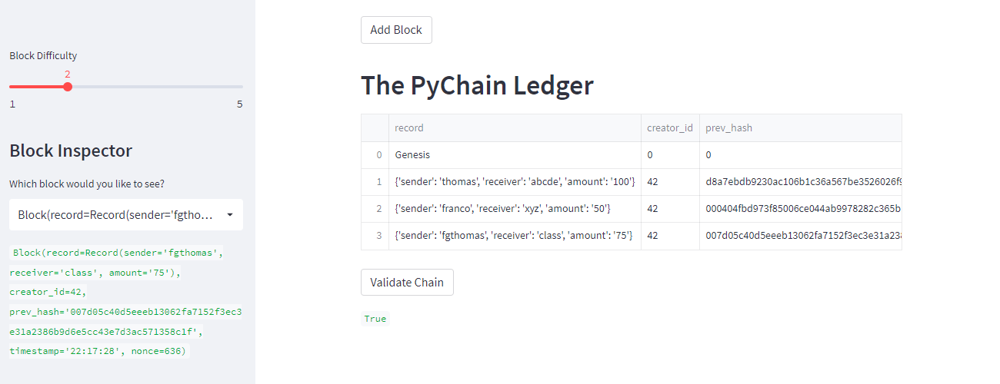

# Blockchain_Ledger_Streamlit

___

During this week's challenge, I play the role of a lead engineer tasked with building a simple blockchain-based ledger system, complete with a user-friendly web interface. This ledger should allow partner banks to conduct financial transactions (that is, to transfer money between senders and receivers) and to verify the integrity of the data in the ledger.
___

## Technologies

This project leverages python 3.7 with various Libraries and IDE:

* [Streamlit](https://streamlit.io/) - An open-source Python library which enables developers to build attractive user interfaces.

___

## Usage

In order to run this program, one should utilize the terminal or Git Bash and VS Code. The following libraries should be imported:

Additionally, in order to view the code in the web interface, the following code should be run:

___

## Results

The pychain.py file provides the code for the following web interface:

Further, one can validate the chain using the "Validate Chain" button.

___

## Contributors

Franco Thomas - francothomas1989@gmail.com

___

## License

MIT License
